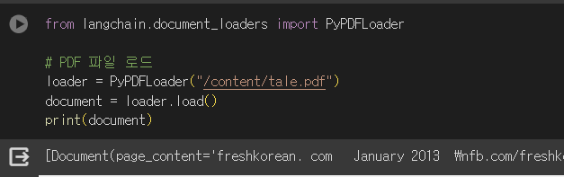
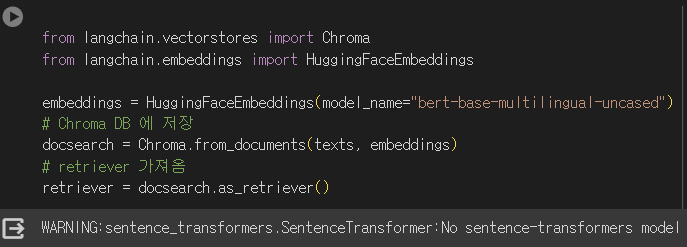
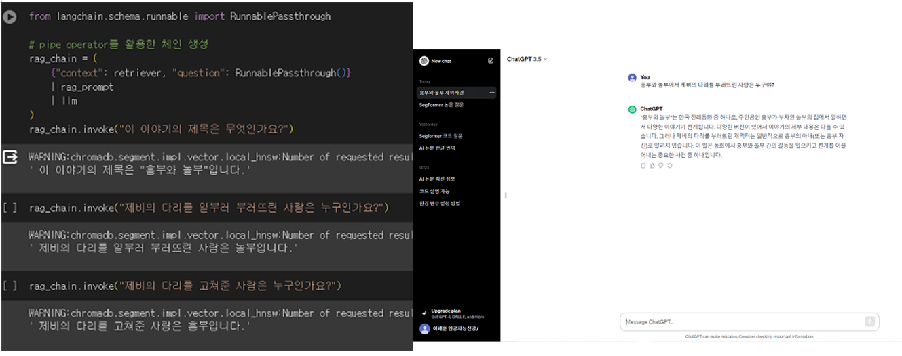
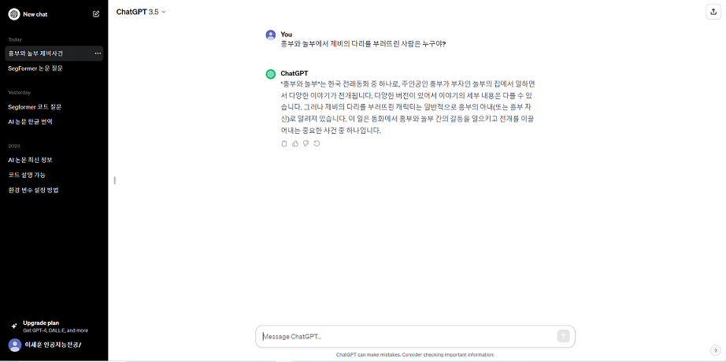

# LANGCHAIN PDF 문서 질의응답 AI오픈소스 201911977_이세훈😿

허깅페이스 llm모델을 이용하여 PDF 문서 질의응을 하는 실습을 진행했습니다.

이번 PDF 질의응답은 langchain의 문서불러오기 - 분할 - 벡터스토어(vectorstore)에 임베딩된 문서를 저장하고 질의응답해 답변을 얻도록 하겠습니다.

아래의 주소는 FILL-MASK모델로 임베딩에 사용된 모델로 다국어를 지원한다.
https://huggingface.co/bert-base-multilingual-uncased

rlm/rag-prompt를 통해 PROMPT를 가져와 사용했다. 아래의 주소는 rlm/rag-prompt에 대해 참고한 사이트다.
https://smith.langchain.com/hub/rlm/rag-prompt

아래의 모델은 한국어도 가능한 LLM모델로 이 모델을 사용했다.
https://huggingface.co/mistralai/Mistral-7B-Instruct-v0.1

사용한 PDF문서는 저작권?의 문제가 발생할 수 있어 올리지 않았습니다.

# 결과 사진

기존 블로그 예제 코드에서 document[0]으로 PDF파일의 1페이지만 불러오던 것을 
수정해 전체 PDF파일을 불러오게 바꿨습니다.

bert-base-multilingual-uncased모델을 HuggingFaceEmbeddings을 이용해 임베딩에 사용했다.

    
왼쪽은 흥부와 놀부 PDF를 추가해서 mistralai/Mistral-7B-Instruct-v0.1모델에 질의응답한 사진이며,
오른쪽은 챗GPT 3.5에 별다른 질문없이 질의 응답한 사진입니다.
두 사진을 비교해보면 왼쪽은 질의에 정확한 답(놀부)을 한 반면에 오른쪽 챗GPT는 오답(흥부아냐 혹은 흥부)을 내놨다.

## 실행 방법
1. 허깅페이스 토큰 설정
2. tale.pdf위치에 원하는 pdf파일 설정
3. ipynb파일 모두 실행
